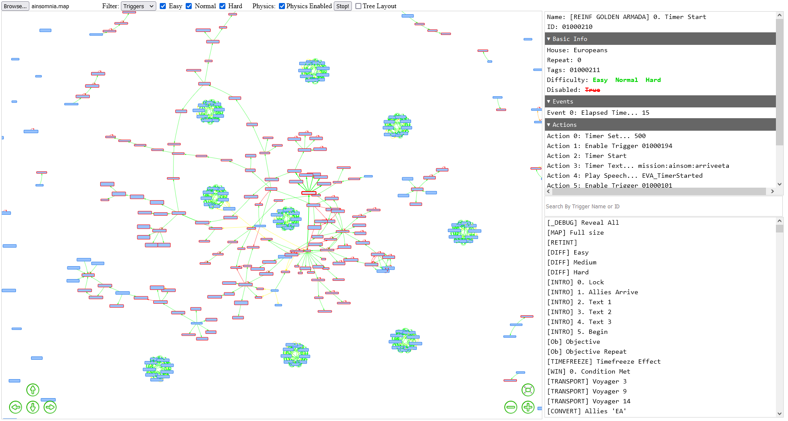

# Trigger-Analyzer

[Trigger-Analyzer](https://whensonzws.github.io/Trigger-Analyzer/) is a visualization tool for maps found in Command and Conquer 2 series of games (Tiberium Sun, Red Alert 2 etc.). \
It visualize triggers found in the map in a network graph, showing how the triggers are related. 

The tool is hosted on [github pages](https://whensonzws.github.io/Trigger-Analyzer/), the tool doesn't utilize web-server, so you can save the webpage for offline uses.

The detailed information about different type of triggers is stored in `fadata.ini`, with its data converted to the json file `fadata.json` by `ini_parse.js`.\
The `fadata.ini` is extracted from [Mental Omega](https://mentalomega.com) 3.3.5. The Red Alert 2 modpack utilize additional trigger types added by [Ares 3.0](https://ares-developers.github.io/Ares-docs/index.html)

The graph library used is the Network from [vis.js](https://visjs.github.io/vis-network/docs/network/)

